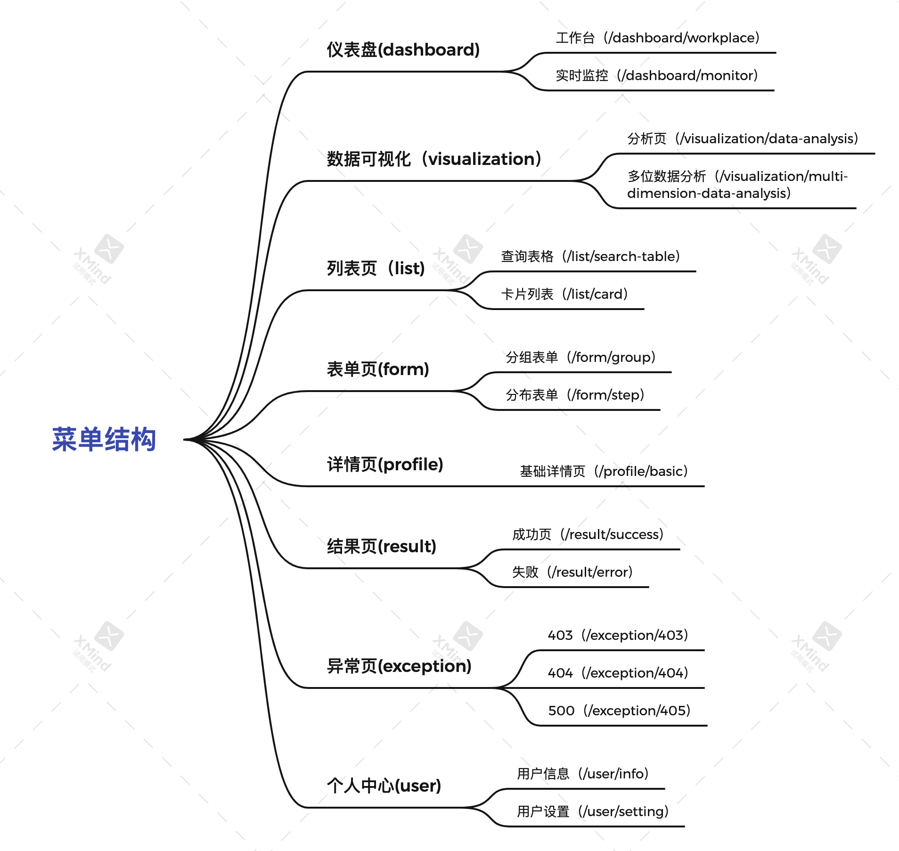

## 该系统技术栈特点
- 基于webpack5.x配置
- eslint严格代码规范
- prettier统一代码风格
- husky代码提交检测
- 环境变量配置规范化

## 技术框架
- [x] react18
- [x] react-dom
- [x] react-router-dom 6.x
- [x] react-hook-form
- [x] hooks
- [x] arco-design

## 代码规范
- [x] eslint
- [x] prettier
- [x] husky

代码层面需要对自己严格要去的规范

## 菜单结构

